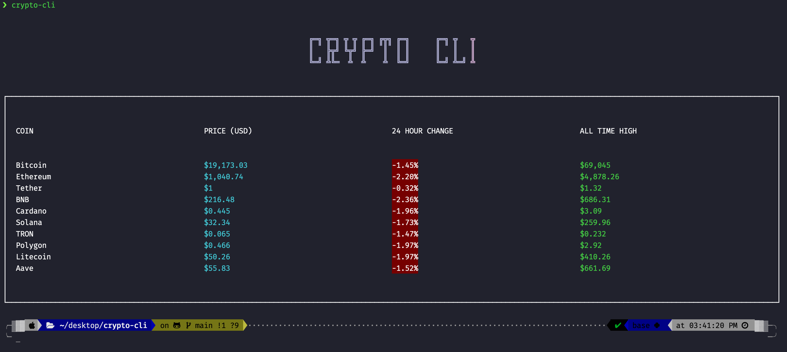

# crypto-cli

> An application that displays the live prices of a few selected cryptocurrencies and tokens. To help get the prices of the tokens, [CoinGecko API](https://github.com/vadimdemedes/create-ink-app) is used.


## Install

- <b>Step 1</b> : Clone the repository

```
gh repo clone srivastavayushi/crypto-cli
```

- <b>Step 2</b> : Run this command in the directory

```
npm install
```

- <b>Step 3</b> : Run

```
crypto-cli
```

## Screenshots of the CLI



